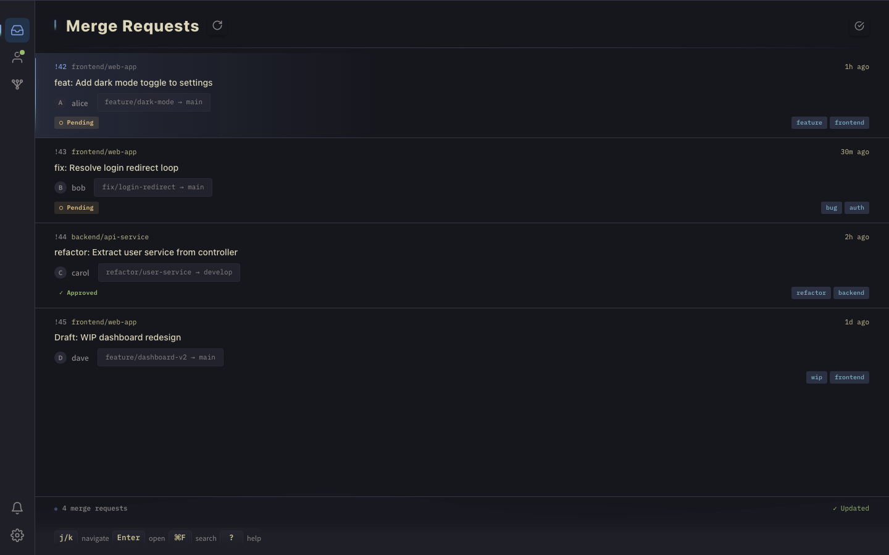
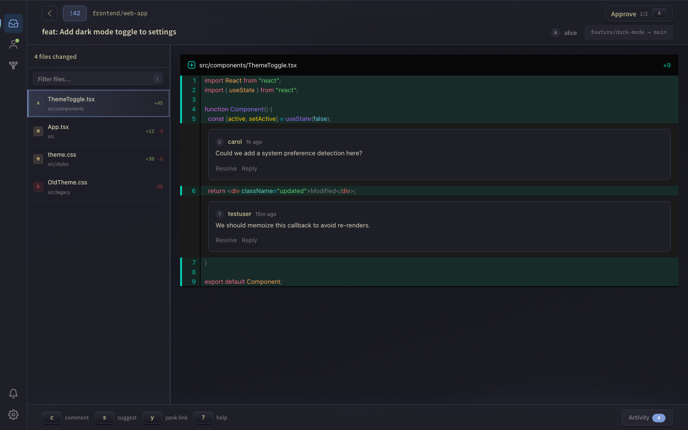
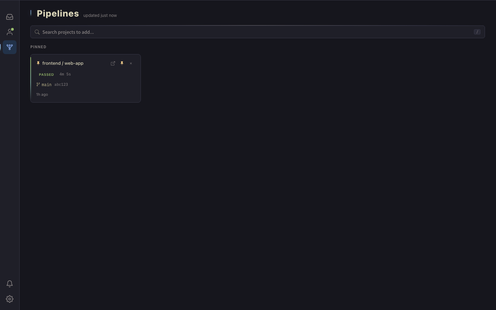

# Ultra GitLab

A local-first GitLab merge request review app built with Tauri, React, and TypeScript.

## Screenshots

### Merge Requests

Browse all merge requests assigned to you for review, with approval status, pipeline badges, and labels at a glance.



### MR Detail & Code Review

Full diff viewer with syntax highlighting, inline comments, file navigation sidebar, and keyboard-driven workflow.



### Pipelines

Monitor CI/CD pipelines for pinned projects with real-time status updates.



## Features

- **Offline-first** — MRs, diffs, and comments are synced to a local SQLite database so you can review without a network connection
- **Keyboard-driven** — navigate files, jump between MRs, approve, and comment without touching the mouse
- **Code review** — syntax-highlighted split/unified diffs with inline commenting, threads, and resolve/unresolve
- **Activity drawer** — discussion threads, system events, and reply-in-place without leaving the diff
- **Pipeline monitoring** — pin projects and track pipeline status, drill into jobs and logs
- **Deep links** — open MRs directly from GitLab via a browser userscript
- **Multi-instance** — connect to multiple GitLab instances simultaneously

## Install

Download the latest `.dmg` from [Releases](../../releases), open it, and drag the app to Applications.

Since the app isn't signed with an Apple Developer certificate, macOS will block it on first launch. To fix this, run:

```bash
xattr -d com.apple.quarantine /Applications/Ultra\ Gitlab.app
```

Then open the app normally.

## Browser Userscript

A Tampermonkey/Greasemonkey userscript is available at [`extras/open-in-ultra-gl.user.js`](extras/open-in-ultra-gl.user.js). It adds an **"Open in Ultra GL"** button to GitLab merge request pages that launches the MR directly in the desktop app via deep link.

Install it by opening the file in your browser with Tampermonkey enabled, or copy-paste it into a new userscript.

## Development

```bash
bun install
bun run tauri dev
```

## Recommended IDE Setup

- [VS Code](https://code.visualstudio.com/) + [Tauri](https://marketplace.visualstudio.com/items?itemName=tauri-apps.tauri-vscode) + [rust-analyzer](https://marketplace.visualstudio.com/items?itemName=rust-lang.rust-analyzer)
